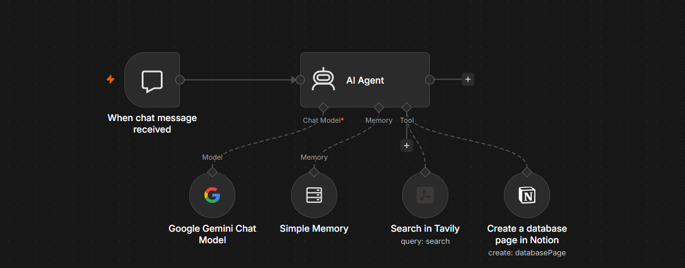

# n8n Research Agent

A self-hosted AI research agent built on n8n Cloud. The agent surfaces fresh web findings, structures them with an LLM, and saves them to a Notion database — all on free tiers, costing **$0/month** to operate.

This is an MVP (Minimum Viable Product). The brain works end-to-end: chat trigger → research → structured save. Future versions plan to add external chat interfaces (Telegram/Discord), persistent cross-session memory, and additional tools.

## Architecture



```
Chat Trigger → AI Agent → Reply with summary
                 │
                 ├─── Chat Model: Google Gemini 2.5 Flash
                 ├─── Memory: Window Buffer (last N exchanges)
                 └─── Tools:
                       ├── Tavily Web Search
                       └── Notion (create database page)
```

The AI Agent is responsible for deciding when to search the web, when to save a finding to Notion, and how to summarize for the user. The persona is defined in the System Message (see [`docs/SOUL-template.md`](docs/SOUL-template.md)).

## Stack

| Component | Service | Cost |
|---|---|---|
| Orchestration | n8n Cloud | Free tier |
| LLM | Google Gemini 2.5 Flash | Free (1500 req/day) |
| Web search | Tavily | Free (1000 searches/month) |
| Structured storage | Notion | Free |
| Memory | n8n Simple Memory (in-instance) | Free |

**Total: $0/month**

## Features

- **Live web research** via Tavily — fresh data with source URLs
- **Structured output** — every research session can be saved as a row in a Notion database
- **Multi-turn memory** — agent remembers the context within a session
- **Customizable persona** — edit one markdown block (the "SOUL") to repurpose the agent for any vertical
- **Zero paid services** — runs entirely on free tiers

## Quick start

1. **Clone this repo**
2. **Set up Notion database** — see [`docs/notion-schema.md`](docs/notion-schema.md)
3. **Get API keys** — see [`docs/setup.md`](docs/setup.md)
4. **Import the workflow** — `workflow/research-agent.json` into n8n
5. **Customize the agent** — paste your version of [`docs/SOUL-template.md`](docs/SOUL-template.md) into the AI Agent's System Message
6. **Test** — open the workflow chat, ask a research question

Full step-by-step in [`docs/setup.md`](docs/setup.md).

## Project status

This repo is **v1 (MVP)** — the brain works end-to-end inside n8n's chat panel.

**v1 — done:**
- Chat → research → save loop
- Tavily web search + Notion structured storage
- Window Buffer memory (single-session)

**v2 — planned next:**
- External chat interface (Google Chat / Telegram / Discord) — the agent receives commands from there instead of n8n's internal chat, making it usable day-to-day
- Persistent memory (Postgres or Mongo) so context survives across sessions

**v3+ — long-term:**
- Additional tools: Google Drive document creation, Reddit pain-point scraping
- Multi-agent expansion: researcher + critic + orchestrator working in concert

## License

MIT — see [`LICENSE`](LICENSE)
